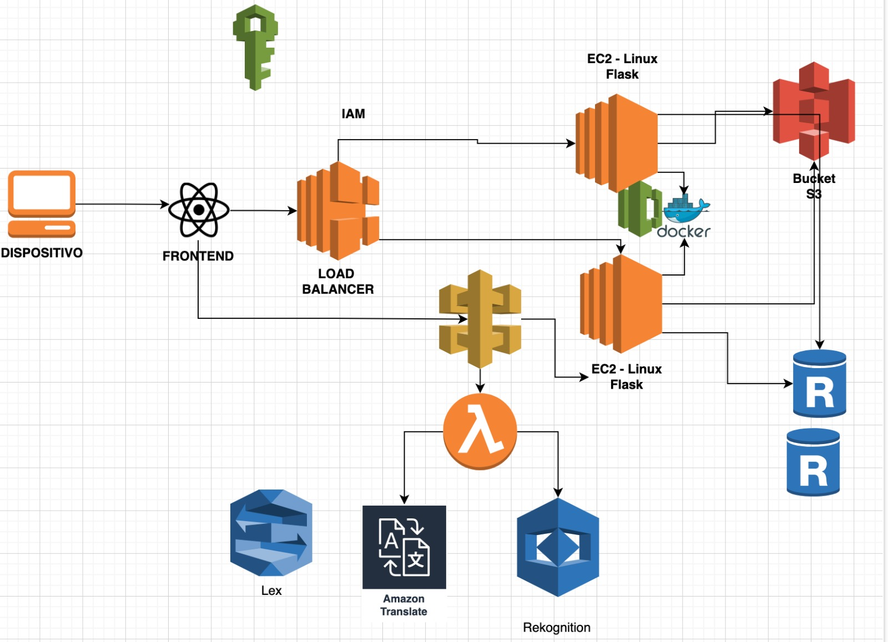

## Manual Técnico Sistema de Registro de Ambulancias

- Xhunik Nikol Miguel Mutzutz - 201900462
- Jefferson Gamaliel Molina Barrios - 201945242
- Walther Andree Corado Paiz - 201313861

### 1. Introducción

Este manual técnico proporciona una descripción detallada del proyecto de un sistema de registro de ambulancias para el cuerpo de bomberos, utilizando tecnologías como JavaScript, Angular y AWS. El sistema permitirá registrar y gestionar información sobre ambulancias, estaciones de bomberos, personal y servicios prestados, de manera más completa y robusta que la versión anterior.

### 2. Objetivos del Proyecto

Los objetivos principales del proyecto siguen siendo los mismos que se mencionaron en el manual anterior, con algunas ampliaciones:

* **Centralizar la información** de forma más granular, incluyendo detalles como el historial de mantenimiento de las ambulancias, la asignación de turnos específicos para cada bombero y métricas de rendimiento individual.
* **Mejorar la eficiencia** en la gestión de las ambulancias y los servicios prestados, automatizando tareas repetitivas como la generación de reportes y optimizando la asignación de recursos.
* **Aumentar la transparencia** en la gestión de los recursos del cuerpo de bomberos, proporcionando paneles de control interactivos y herramientas de análisis de datos.
* **Brindar información útil** para la toma de decisiones estratégicas, permitiendo identificar tendencias, patrones y áreas de mejora en el servicio.

### 3. Descripción del Proyecto

El sistema de registro de ambulancias se compone de los siguientes módulos:

**3.1 Módulo de Ambulancias:**

* Permite registrar y gestionar información detallada sobre las ambulancias, incluyendo:
    * Placa
    * Estación a la que pertenece
    * Kilometraje actual
    * Historial de mantenimiento (fechas, trabajos realizados, costos)
    * Estatus (disponible, en servicio, mantenimiento, reparación)
    * Sensor de ubicación GPS (opcional)
* Implementación de un sistema de alertas para notificaciones automáticas en caso de:
    * Vencimiento del próximo mantenimiento
    * Posible avería o falla detectada por los sensores
    * Exceso de velocidad o conducción imprudente

**3.2 Módulo de Estaciones de Bomberos:**

* Permite registrar y gestionar información completa sobre las estaciones de bomberos, incluyendo:
    * Dirección
    * Personal asignado (por turno y rango)
    * Turnos (horarios, responsables)
    * Recursos disponibles (ambulancias, motobombas, camiones cisterna)
    * Mapa interactivo para visualizar la ubicación de las estaciones
* Implementación de un sistema de gestión de turnos que permita:
    * Asignar turnos a cada bombero de manera eficiente y equitativa
    * Registrar las ausencias, permisos y licencias del personal
    * Visualizar la disponibilidad de personal en tiempo real
    * Generar reportes de horas trabajadas por cada bombero

**3.3 Módulo de Personal:**

* Permite registrar y gestionar información exhaustiva sobre el personal del cuerpo de bomberos, incluyendo:
    * Nombre completo
    * Apellidos
    * Dirección de vivienda
    * Fecha de nacimiento
    * Género
    * Rango
    * Número de identificación (casco o adhesión)
    * Fotografía
    * Tipo de contrato (permanente, ad honorem)
    * Historial de capacitación y certificaciones
    * Evaluación de desempeño (opcional)
* Implementación de un sistema de autenticación y autorización robusto que permita:
    * Controlar el acceso a la plataforma solo para personal autorizado
    * Definir roles y permisos de usuario específicos
    * Registrar intentos de acceso fallidos y actividades sospechosas
    * Cumplir con las normas de seguridad de la información

**3.4 Módulo de Servicios:**

* Permite registrar y gestionar información detallada sobre los servicios prestados por las ambulancias, incluyendo:
    * Estación que atiende el servicio
    * Fecha y hora de inicio y fin del servicio
    * Placa de la ambulancia utilizada
    * Kilometraje inicial y final
    * Datos del paciente (si se conocen):
        * Nombre completo
        * Apellido
        * DPI (si es posible)
        * Dirección de donde se recoge al paciente
        * Hospital al que se traslada
    * Descripción del incidente y acciones realizadas por los bomberos
    * Fotografías del lugar del incidente (opcional)
    * Placas de la policía nacional civil, policía de tránsito y otras instituciones presentes (opcionales)
    * Firma digital del mayor encargado de la estación para aprobar el reporte
* Implementación de un sistema de seguimiento de servicios en tiempo real que permita:
    * Visualizar la ubicación de las ambulancias en servicio en un mapa interactivo
    * Monitorear el progreso de cada servicio
    * Estimar el tiempo de llegada al lugar del incidente
    * Generar alert

    ## Continuación del Manual Técnico Detallado para el Sistema de Registro de Ambulancias

### 3.4 Módulo de Servicios (Continuación)

* Implementación de un sistema de seguimiento de servicios en tiempo real que permita (continuación):
    * Generar alertas automáticas en caso de retrasos o emergencias
    * Optimizar la asignación de ambulancias en función de la ubicación y disponibilidad

**3.5 Panel de Control e Informes:**

* Se desarrollará un panel de control interactivo que permita a los usuarios autorizados visualizar información clave del sistema en tiempo real, incluyendo:
    * Número de ambulancias disponibles por estación
    * Número de servicios en curso
    * Tiempos promedio de respuesta
    * Métricas de desempeño del personal
    * Indicadores de mantenimiento preventivo de las ambulancias
* Se implementará un módulo de generación de informes personalizables que permita a los usuarios:
    * Exportar datos a diferentes formatos (CSV, Excel, PDF)
    * Filtrar y ordenar los datos por diversos criterios
    * Crear informes personalizados para satisfacer necesidades específicas
    * Analizar tendencias y patrones en los servicios prestados

### 4. Arquitectura Tecnológica

El sistema se implementará utilizando las siguientes tecnologías en la nube AWS:

* **Frontend:** Angular
    * Angular es un framework JavaScript de código abierto para desarrollar aplicaciones web dinámicas de una sola página (SPA). Se utilizará para crear una interfaz de usuario (UI) interactiva y responsive para el sistema.
* **Backend:** Node.js con Express.js
    * Node.js es un entorno de ejecución de JavaScript del lado del servidor que permite desarrollar aplicaciones web escalables y en tiempo real. Express.js es un framework de Node.js que proporciona estructuras y funcionalidades para crear aplicaciones web backend robustas.
* **Base de datos:** Amazon DynamoDB
    * Amazon DynamoDB es una base de datos NoSQL altamente escalable y de alto rendimiento. Se utilizará para almacenar y gestionar los datos del sistema debido a su flexibilidad y capacidad de manejar grandes volúmenes de datos.
* **Almacenamiento de archivos:** Amazon S3
    * Amazon S3 se seguirá utilizando para almacenar archivos como fotografías del personal, del lugar del incidente y documentos relacionados con el mantenimiento de las ambulancias.
* **Autenticación y Autorización:** Amazon Cognito
    * Amazon Cognito se utilizará para proporcionar servicios de autenticación, autorización y gestión de usuarios. Esto garantiza un control de acceso seguro y centralizado a la plataforma.
* **AWS Lambda:**
    * AWS Lambda se utilizará para ejecutar funciones sin servidor que se activan por eventos específicos en el sistema. Por ejemplo, se pueden crear funciones Lambda para enviar notificaciones automáticas, procesar datos de sensores de ubicación GPS o generar informes personalizados.
* **AWS CloudWatch:**
    * AWS CloudWatch se utilizará para monitorizar el rendimiento del sistema, registrar eventos y detectar errores. Esto permite un mantenimiento proactivo y una experiencia de usuario óptima.

### 5. Seguridad

La seguridad es una prioridad fundamental en este sistema. Se implementarán las siguientes medidas de seguridad:

* **Cifrado de datos:** Todos los datos en tránsito y en reposo se cifrarán utilizando protocolos estándar de la industria.
* **Controles de acceso:** Solo el personal autorizado tendrá acceso al sistema, y se implementarán controles de acceso granular para limitar el acceso a los datos en función del rol del usuario.
* **Registro de auditoría:** Se registrarán todas las actividades del usuario para garantizar la trazabilidad y detectar posibles actividades sospechosas.
* **Pruebas de penetración:** Se realizarán pruebas de penetración periódicas para identificar y mitigar las vulnerabilidades del sistema.

Este manual técnico detallado proporciona una visión más completa del sistema de registro de ambulancias.  Las tecnologías de AWS permiten una mayor escalabilidad, flexibilidad y seguridad para la gestión de los recursos del cuerpo de bomberos.

