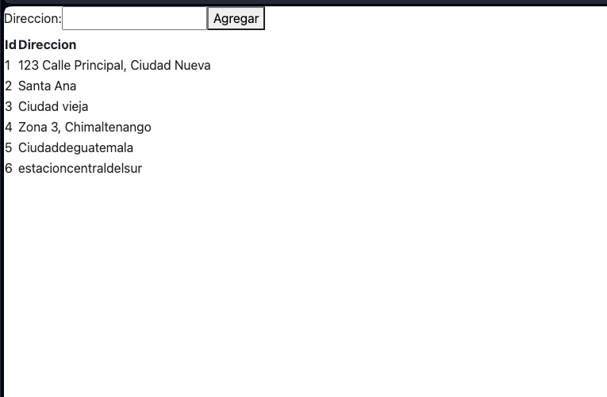

## Manual de Usuario - Sistema de Registro de Ambulancias

- Walther Andree Corado Paiz - 201313861
- Xhunik Nikol Miguel Mutzutz - 201900462
- Jefferson Gamaliel Molina Barrios - 201945242

## 1. Inicio de Sesión y Registro

### 1.1 Ingreso al Sistema
- **Credenciales:** Para ingresar, visite la página de inicio y haga clic en "Iniciar sesión". Introduzca su nombre de usuario y contraseña y luego seleccione "Entrar".
- **Reconocimiento Facial:** Si su dispositivo lo permite, puede optar por iniciar sesión mediante reconocimiento facial. Haga clic en "Iniciar sesión con reconocimiento facial", asegúrese de estar en un lugar bien iluminado y siga las instrucciones en pantalla.
- **Registro:** Si es nuevo en el sistema, seleccione "Registrarse". Proporcione la información solicitada como nombre, dirección de correo electrónico, y contraseña. Además, deberá capturar una imagen de su rostro para el reconocimiento facial. Siga las instrucciones en pantalla para completar el registro.

## 2. Bienvenida de Perfil

Una vez ingresado al sistema, será dirigido a la página de perfil donde se mostrará:
- **Imagen de Bienvenida:** Una captura de su rostro tomada durante el último inicio de sesión por reconocimiento facial.
- **Información del Usuario:**
  - **USUARIO:** Su nombre de usuario.
  - **NOMBRE:** Su nombre completo.
  - **Idiomas:** Los idiomas que ha registrado como que domina.
  - **Descripción:** Una breve descripción sobre usted.
- **Datos del Reconocimiento Facial:** Se mostrarán estimaciones como la edad, género y estado emocional basado en el análisis facial más reciente.

## 3. Registro de Ambulancia

Para registrar una nueva ambulancia en el sistema:
- Acceda al formulario de "Registrar Ambulancia" desde el menú principal.
- Complete el formulario con la siguiente información:
  - **Tipo:** Tipo de ambulancia (e.g., básica, avanzada).
  - **Kilómetros:** Kilometraje actual de la ambulancia.
  - **Estación:** Estación a la que pertenece la ambulancia.
- Haga clic en "Agregar" para registrar la ambulancia en el sistema.

## 4. Registro de Estación

Para registrar una nueva dirección:
- Acceda al formulario de "Registrar Dirección".
- Complete el campo de "Dirección".
- Al hacer clic en "Agregar", el sistema automáticamente asignará un ID único a esta dirección.

## 5. Registro de Hospital

Para agregar un hospital al sistema:
- Acceda al formulario de "Registrar Hospital".
- Ingrese el nombre del hospital y su dirección en los campos correspondientes.
- Haga clic en "Agregar" para guardar la información en el sistema.

Este manual proporciona las instrucciones básicas para el uso eficiente del sistema de registro de ambulancias. Para asistencia adicional, consulte la sección de ayuda o contacte al soporte técnico.

## 6. Reportes de Digitalizados

En este enocontramos los reportes digitalizados para poder obtener la información requerida

